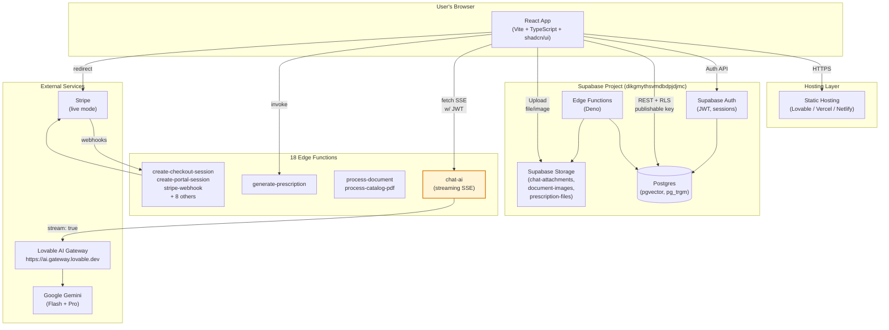
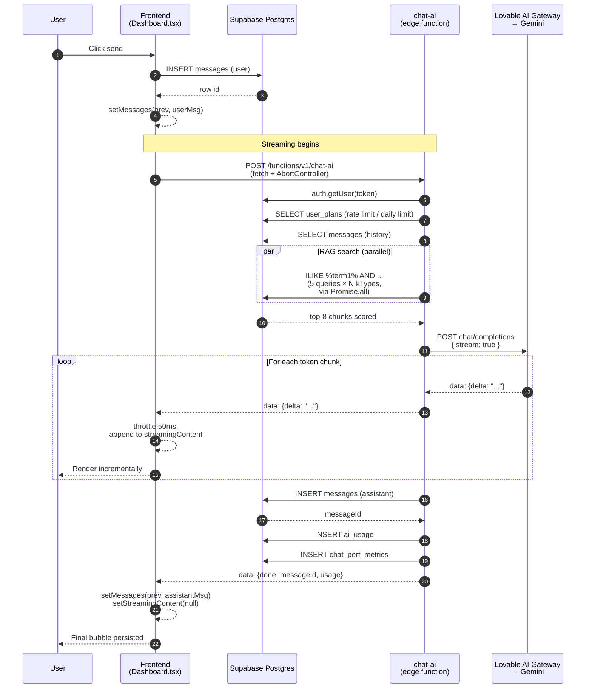
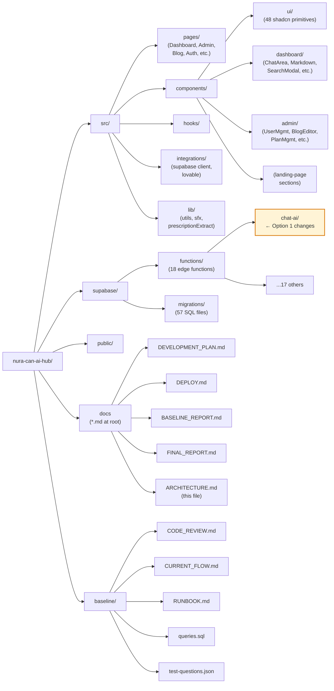
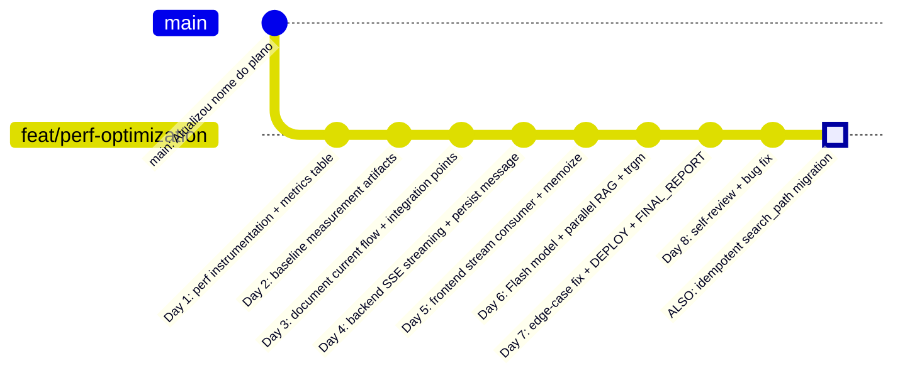
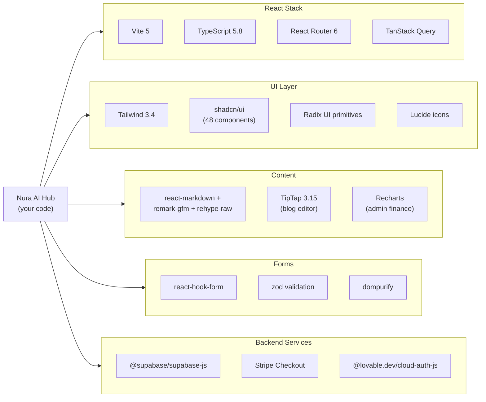
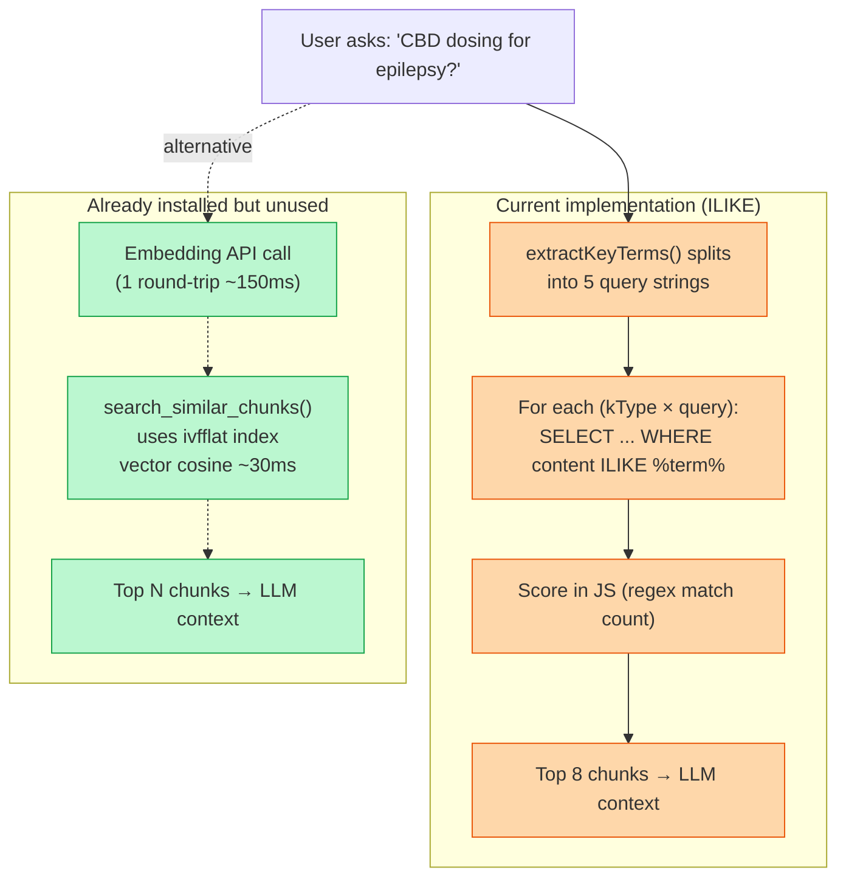

# Nura AI Hub — System Architecture

Visual reference for the full system after Option 1 optimization work. Renders in VS Code (with Markdown Preview), GitHub, GitLab, and most modern markdown viewers.

---

## 1. High-level system architecture



The yellow-highlighted **chat-ai** is what Option 1 modified.

---

## 2. Chat request flow (after Option 1)



**Key changes vs. before Option 1:**
- Steps 9-13 used to be one blocking request: full response arrived after 15-25s
- Now: first token in step 11 arrives in ~1s
- Step 16 used to happen on the frontend (Dashboard.tsx); moved to backend so responses survive client disconnects

---

## 3. Database schema (key tables for chat flow)

```mermaid
erDiagram
    auth_users ||--o{ profiles : "1:1"
    auth_users ||--o{ user_plans : "1:N (multiple subs)"
    auth_users ||--o{ user_roles : "1:N"
    auth_users ||--o{ conversations : "owns"
    conversations ||--o{ messages : "contains"
    conversations ||--o{ chat_perf_metrics : "tracks"
    conversations ||--o{ ai_usage : "tracks"
    knowledge_documents ||--o{ document_chunks : "split into"

    auth_users {
        uuid id PK
        text email
    }

    profiles {
        uuid id PK_FK
        text full_name
        bool profile_completed
        int receituario_usage_count
    }

    user_plans {
        uuid id PK
        uuid user_id FK
        text plan_type
        text status
        timestamptz current_period_end
        bool cancel_at_period_end
        text stripe_customer_id
    }

    conversations {
        uuid id PK
        uuid user_id FK
        text title
        text model_type
        timestamptz created_at
    }

    messages {
        uuid id PK
        uuid conversation_id FK
        text role
        text content
        jsonb attachments
        timestamptz created_at
    }

    knowledge_documents {
        uuid id PK
        text title
        text knowledge_type "medical/legal/veterinary"
    }

    document_chunks {
        uuid id PK
        uuid document_id FK
        int chunk_order
        text content
        vector embedding "pgvector(1536) - unused"
    }

    ai_usage {
        uuid id PK
        uuid user_id FK
        uuid conversation_id FK
        text model
        int tokens_input
        int tokens_output
        numeric cost
    }

    chat_perf_metrics {
        uuid id PK
        uuid conversation_id FK
        uuid user_id FK
        int duration_total_ms
        int duration_rag_ms
        int duration_llm_ms
        int duration_ttft_ms
        int rag_chunk_count
        int tokens_input
        int tokens_output
    }
```

**`chat_perf_metrics`** is new in Option 1.
**`document_chunks.embedding`** column has populated pgvector embeddings but is currently unused (see Option 2 candidates).

---

## 4. Project structure



---

## 5. Option 1 work — phase status

```mermaid
flowchart LR
    P0["Phase 0<br/>Diagnosis &amp; Baseline"]
    P1A["Phase 1A<br/>Backend Streaming"]
    P1B["Phase 1B<br/>Frontend Streaming"]
    P1C["Phase 1C<br/>Memoization"]
    P1D["Phase 1D<br/>Manual Tests"]
    P2["Phase 2<br/>Model Swap"]
    P3["Phase 3<br/>RAG Parallel + Index"]
    P4["Phase 4<br/>Verification &amp; Handoff"]

    P0 --> P1A --> P1B --> P1C --> P1D --> P2 --> P3 --> P4

    classDef done fill:#bbf7d0,stroke:#16a34a,stroke-width:2px
    classDef blocked fill:#fed7aa,stroke:#ea580c,stroke-width:2px
    classDef pending fill:#e5e7eb,stroke:#6b7280,stroke-width:2px

    class P1A,P1B,P1C,P2,P3 done
    class P0,P1D,P4 blocked
```



**Legend:** 🟢 done · 🟠 code done, blocked on env access · ⚪ pending

---

## 6. Commit history (Option 1 branch)



---

## 7. External dependencies map



---

## 8. The pgvector finding (Option 2 candidate)



**Currently:** sequential ILIKE queries (now parallelized in Option 1, ~1-2s p95)
**Available with ~1 day work:** semantic search using already-installed pgvector (~100ms p95, more relevant results)

---

## How to render these diagrams

| Tool | Action |
|---|---|
| **VS Code** | Install "Markdown Preview Mermaid Support" extension, then `Ctrl+Shift+V` on this file |
| **GitHub / GitLab** | Renders automatically when this file is viewed on the web |
| **Mermaid Live Editor** | Copy any `mermaid` block into https://mermaid.live for export to SVG/PNG |
| **CLI (PNG export)** | `npx @mermaid-js/mermaid-cli -i ARCHITECTURE.md -o diagrams.pdf` |
| **Pandoc** | `pandoc ARCHITECTURE.md -o ARCHITECTURE.pdf --filter mermaid-filter` |

If you want individual PNGs, the easiest path is the Mermaid Live Editor — paste each block, hit Export.
